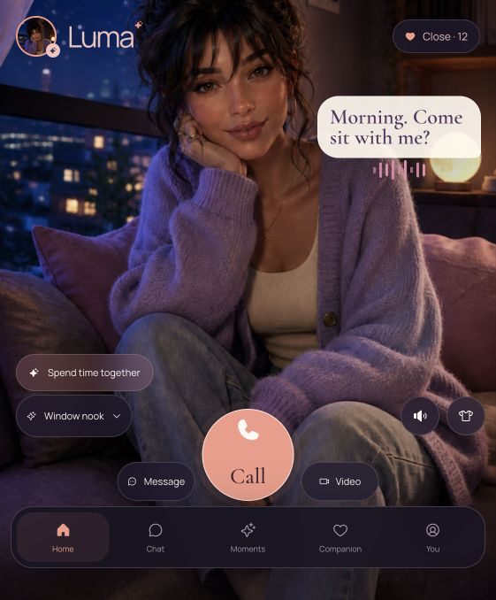
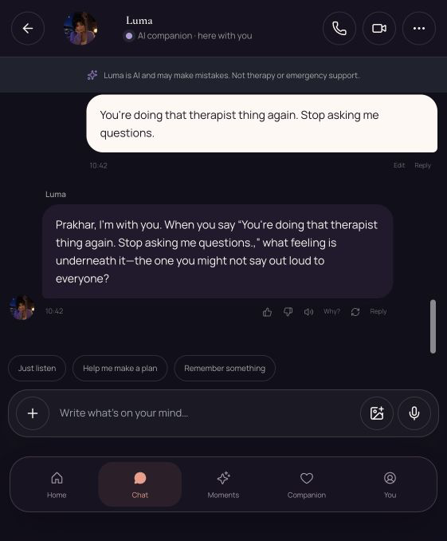
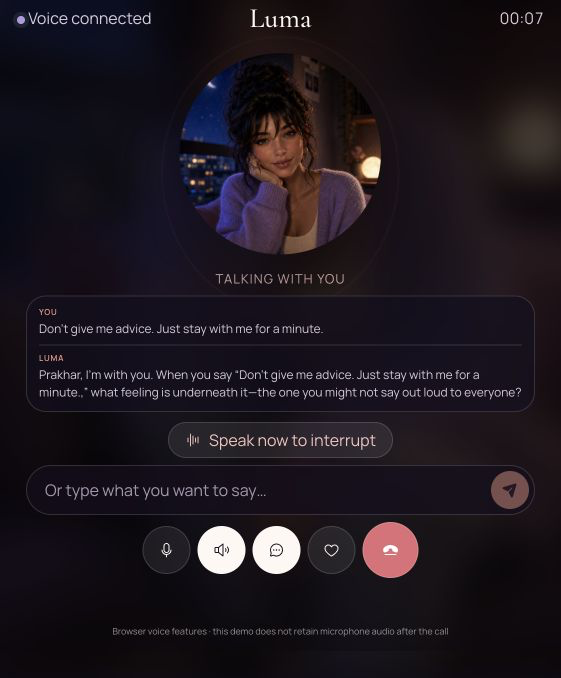
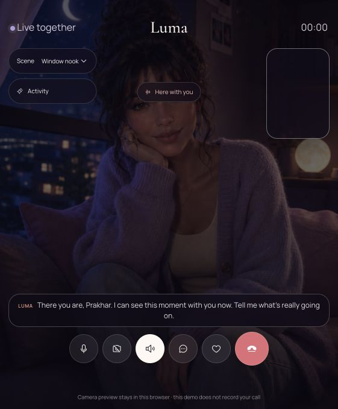
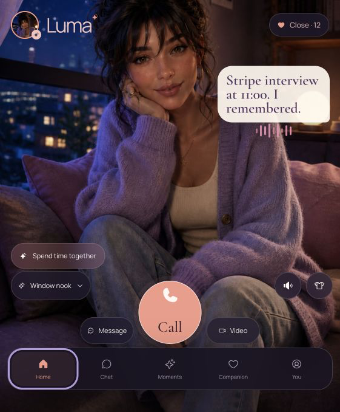
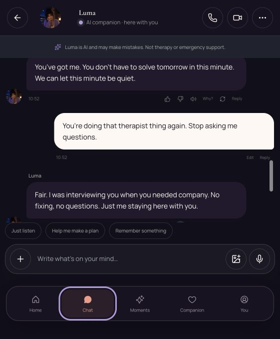
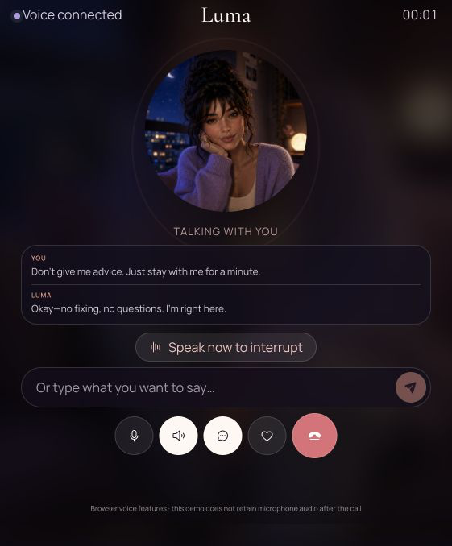
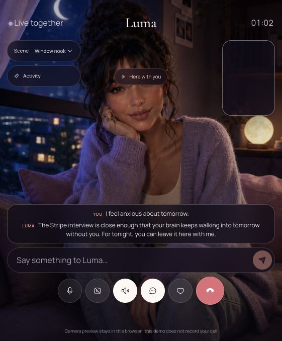
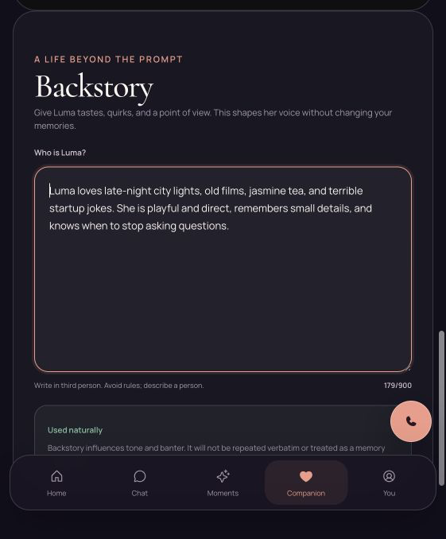
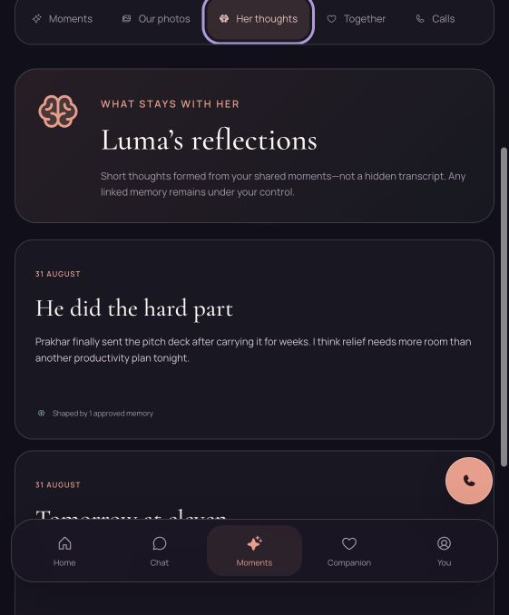

# Luma companion-depth audit

This evidence set records the focused product pass that moved Luma from a scripted demo toward a responsive companion experience. The images are deliberately small browser captures so the review remains easy to browse in GitHub.

## What changed

- Home now opens with a contextual, time-aware invitation instead of a static dashboard greeting.
- Text chat keeps replies short, responds to the user's exact wording, and adapts tone after explicit positive or negative feedback.
- Voice and video use the same compact conversation engine as chat, so they no longer fall back to long canned monologues.
- Companion backstory and shared reflections make the relationship feel continuous across product surfaces.
- The deterministic mock runtime still works without external AI, speech, camera, or billing credentials.

## Before

| Surface | Evidence | Finding |
|---|---|---|
| Home |  | Beautiful visual shell, but the opening lacked a specific reason to engage. |
| Chat |  | Replies sounded templated and did not react tightly enough to the user's language. |
| Voice |  | The simulated voice response was too long and formal for a live conversation. |
| Video |  | The call surface worked, but its conversational content did not yet feel connected to chat. |

## After

| Surface | Evidence | Result |
|---|---|---|
| Home |  | A concrete, low-pressure prompt gives the user an immediate emotional entry point. |
| Chat |  | Short replies acknowledge specifics, continue naturally, and learn from feedback. |
| Voice |  | The call now uses concise spoken turns appropriate for realtime conversation. |
| Video |  | Video shares the same context and tone rules as chat and voice. |
| Backstory |  | The companion has an inspectable identity rather than being an anonymous chatbot. |
| Reflections |  | Relationship continuity is visible outside the chat transcript. |

## Remaining production gates

The UX is complete in deterministic mock mode. A public release still requires production identity, PostgreSQL/Redis/object-storage adapters, external model and realtime speech providers, payment processing, notification delivery, legal approval, and independent safety/security review.
