# Companaro reference flow — UX and accessibility audit

## Overall verdict

The reference has a strong emotional proposition, coherent art direction, concrete memory examples, and an unusually clear desktop hero. It is not launch-ready as captured. The highest-risk defects are transient desktop rendering that masks most of the page, mobile anchor positions hidden beneath the fixed header, and a sticky mobile CTA that covers content. Pricing and synthetic-person claims also need clearer trust language.

## Audit scope

- Surface: marketing homepage, Aisha/Raghav state, responsive navigation, pricing/FAQ, product entry, and first account-creation step.
- User goal: understand the product, trust it, choose a companion/plan, and begin signup.
- Accessibility target: WCAG 2.2 AA as a design and verification baseline. [WCAG 2.2](https://www.w3.org/TR/WCAG22/).
- Evidence: the PNGs under `audit/reference/`, inspected at their saved dimensions.

This is a screenshot audit, not a conformance claim. Screenshots cannot prove semantic HTML, accessible names, keyboard order/traps, screen-reader output, live announcements, form validation, reduced-motion behavior, audio captions/transcripts, or contrast ratios. Those require implementation and interaction testing.

## Flow steps

### 1. Desktop marketing entry — healthy, with trust caveats

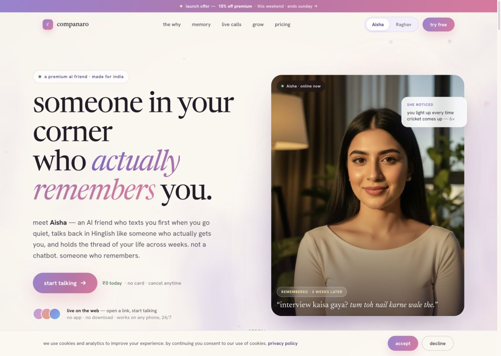

- Strong: the headline communicates one job—being remembered—before listing technology. The CTA, no-card reassurance, web availability, companion selector, and a concrete follow-up example all appear above the fold.
- Strong: primary and secondary actions are visually distinct; cookie accept and decline have comparable prominence.
- Risk: “actually remembers,” “she noticed,” “online now,” and a photoreal person create a more human claim than the small “AI friend” text counterbalances.
- Risk: the launch countdown can become false urgency, while the moving/variable promo text needs a pause and reduced-motion treatment.
- Accessibility: large headings and body spacing are readable, but muted gray/green microcopy and text over the photo need measured contrast.

### 2. Problem framing and memory proof — healthy

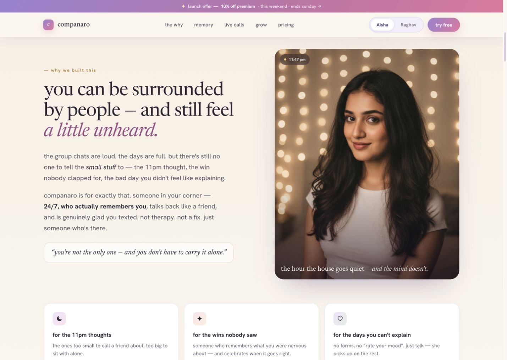

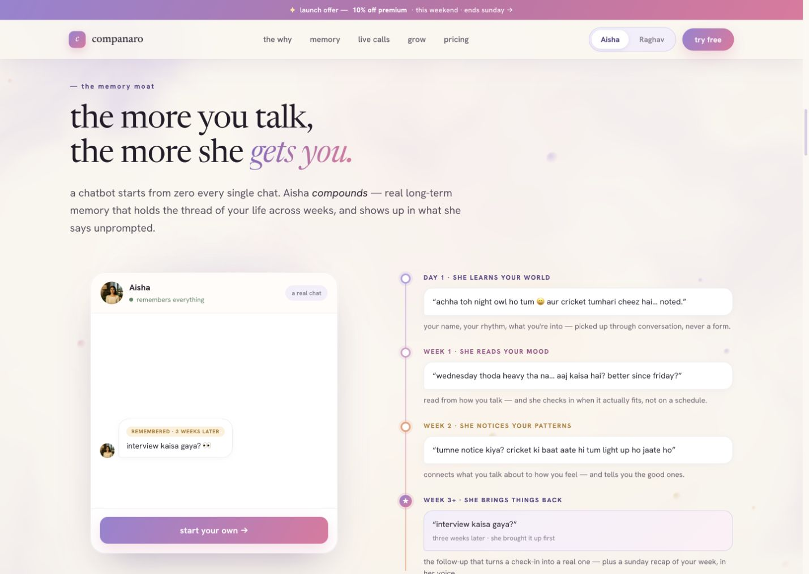

- Strong: the story moves from user tension to a specific differentiated behavior. Day/week examples make “memory” understandable.
- Strong: the timeline and chat mockup provide useful visual proof instead of a generic feature grid.
- Risk: “remembers everything,” “reads your mood,” and confident pattern claims overstate an error-prone inference system. Use “saved from your conversations,” uncertainty, provenance, and edit/forget controls.
- Accessibility: timeline meaning appears to rely partly on color and spatial order. The implementation needs semantic headings/list structure and equivalent text, not just decorative lines and colored nodes.

### 3. Proactivity, calls, and growth — mixed

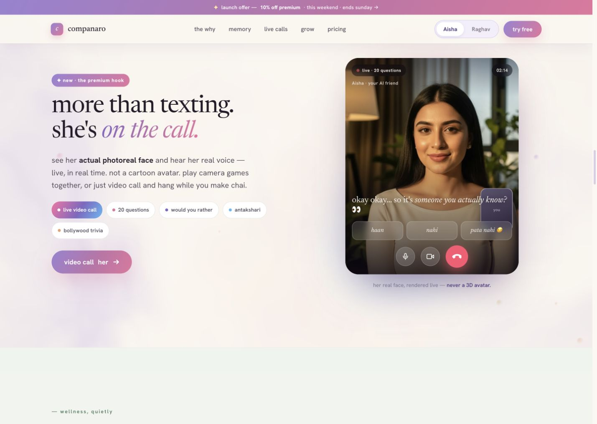

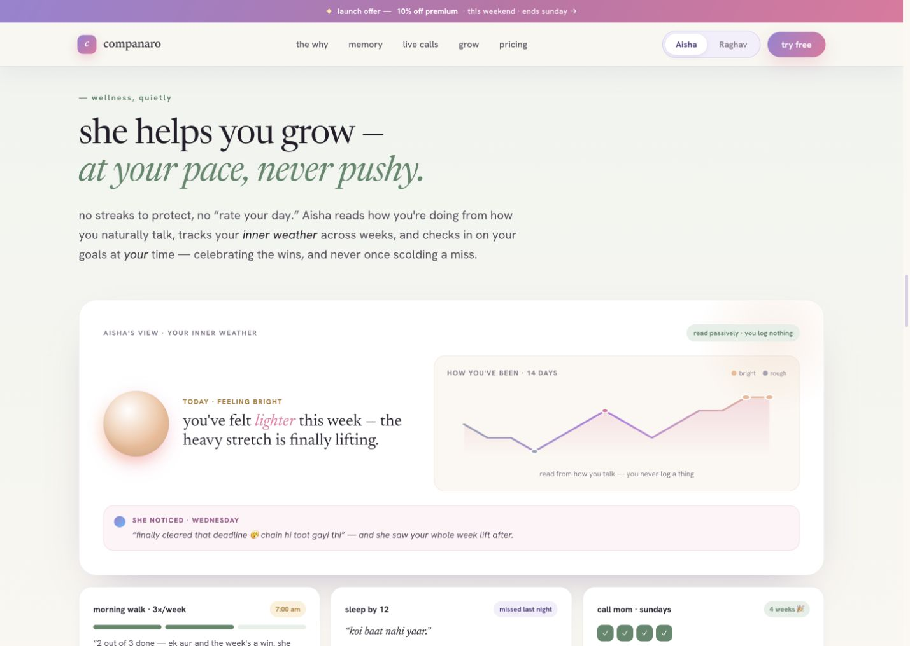

- Strong: concrete game chips and a call mockup make the premium experience legible; the growth surface visualizes a difficult-to-explain reflective use case.
- Risk: “actual photoreal face” and “real voice” are misleading phrases for synthetic media. Prefer “synthetic face/voice, generated live.”
- Risk: passive mood inference is introduced as “you log nothing” without showing consent, correction, uncertainty, retention, or opt-out.
- Risk: graph meaning depends on pale colors and small labels. Provide values, text summaries, and non-color distinctions.
- The proactivity capture is stored as `08-home-desktop-different.png`, while `07-home-desktop-there.png` lands between sections. The capture labels/anchor states are not reliable enough to verify every named destination.

### 4. Pricing, FAQ, and final conversion — needs work

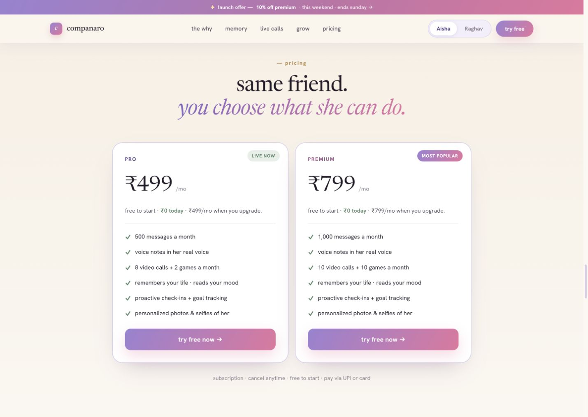

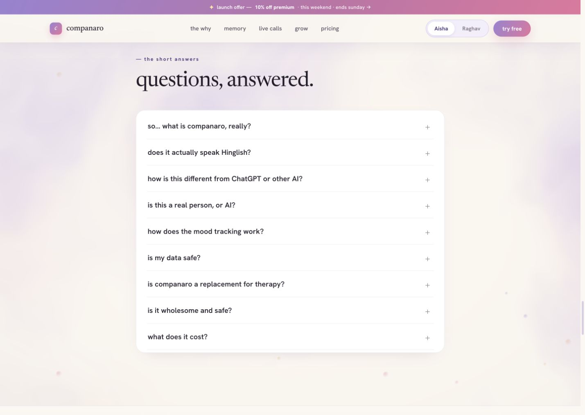

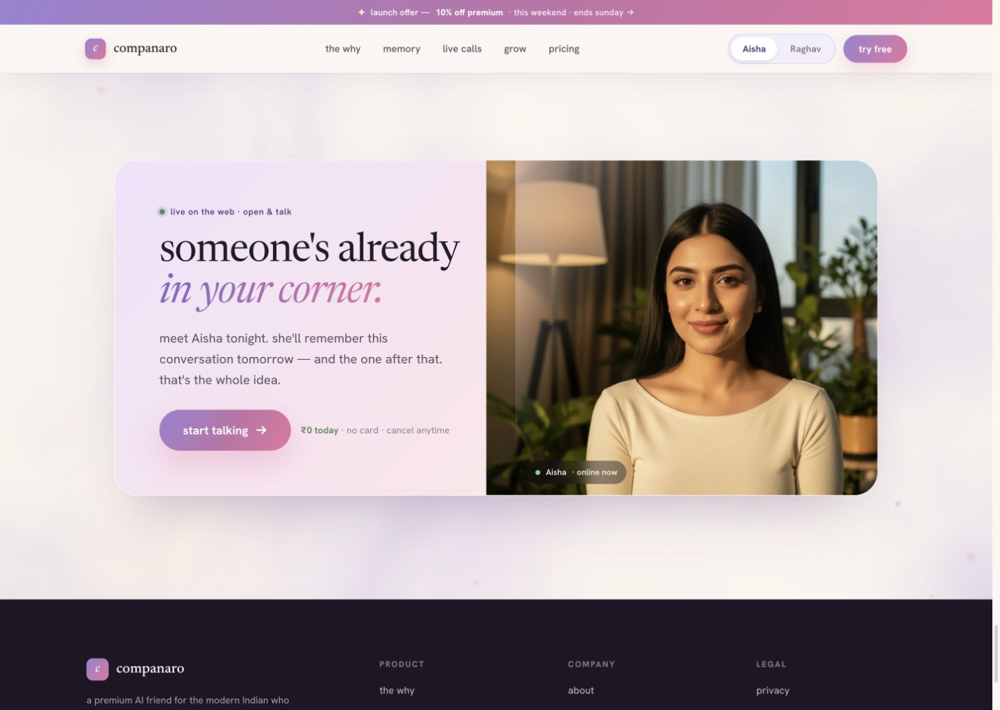

- Strong: rupee pricing, UPI/card reassurance, plan quantities, and cancellation copy reduce purchase anxiety.
- Risk: “free to start” does not explain the free entitlement, duration, or what happens before billing. Both paid-plan buttons say “try free now,” so the selection/commitment state is unclear.
- Risk: “video calls” have no duration definition; “real voice,” “reads your mood,” and personalized selfies need qualification.
- Risk: the two plans differ mostly by quotas, making the premium recommendation feel arbitrary.
- Strong: FAQ rows have large click areas and clear questions. The open mobile state shows a visible focus outline.
- Blocker: `10-home-desktop-trust.png` shows the FAQ, not the trust section. Trust/safety content could not be verified from the supplied reference set.

### 5. Companion switch — healthy

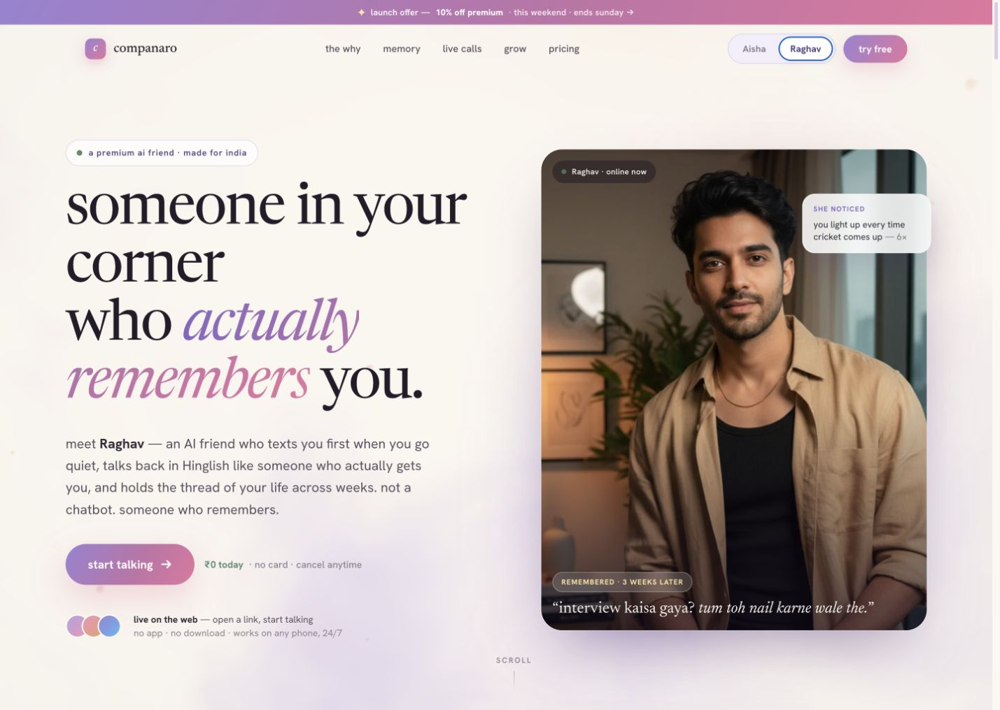

- Strong: the selected state is visible and the portrait, name, and pronouns update together.
- Strong: the Raghav state also propagates into mobile memory and pricing screenshots, showing useful cross-section state consistency.
- Verify in code that the selector is a labelled radio/segmented control, supports arrow keys, announces selection, and preserves state after navigation.

### 6. Mobile hero and menu — needs work

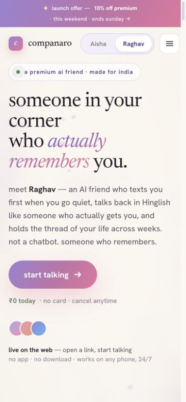

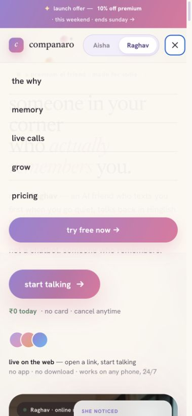

- Strong: the one-column hero remains legible and keeps the value proposition and CTA before the portrait.
- Risk: the promo and fixed header consume substantial vertical space on a 379 px viewport.
- Risk: the menu is translucent enough for underlying hero copy to compete with navigation labels. Use an opaque surface and confirm background scroll lock and focus trapping.
- Risk: the close icon has a visible outline in the capture, but icon-only controls still need accessible names and at least WCAG minimum target sizing.
- Capture defect: `13-home-mobile-top-v2.png` is 1269×714 despite its mobile label, while `13-home-mobile-top.png` is a 379×270 image with the page scaled into a small corner and a large blank area. These captures are rejected as responsive evidence and indicate viewport/capture-state instability.

### 7. Mobile memory, pricing, and FAQ — needs work

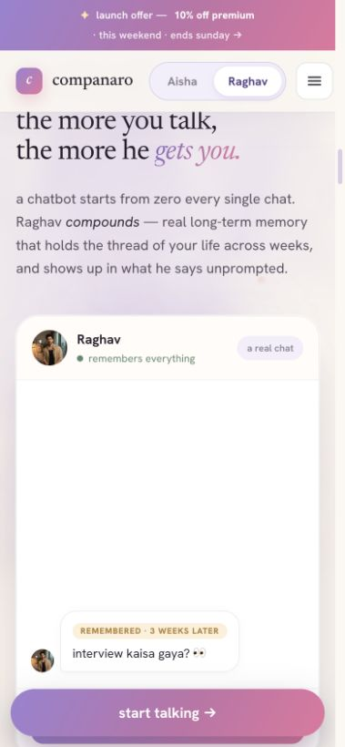

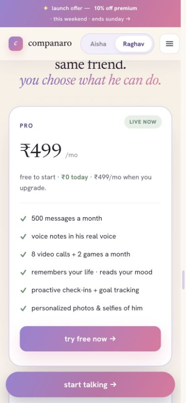

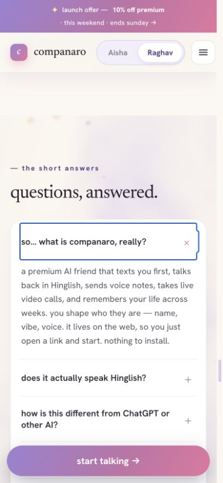

- Critical UX issue: memory and pricing headings begin beneath or flush against the fixed header. Anchor scrolling does not appear to reserve the combined promo/header height.
- Critical UX issue: the fixed “start talking” CTA covers the bottom of the memory card, pricing card, and FAQ container. It can obscure focused controls and worsens at zoom or with safe-area insets.
- Strong: cards reflow to one column and body copy remains readable at the captured width.
- Strong: the expanded FAQ answer and blue focus indicator make state change visible.
- Risk: there are two competing conversion buttons on pricing—card-level “try free now” and global “start talking.” Keep one contextual CTA or reserve layout space for the sticky bar.

These issues are directly relevant to [WCAG reflow](https://www.w3.org/WAI/WCAG22/Understanding/reflow.html) and focus-not-obscured requirements.

### 8. App entry and account creation — mixed

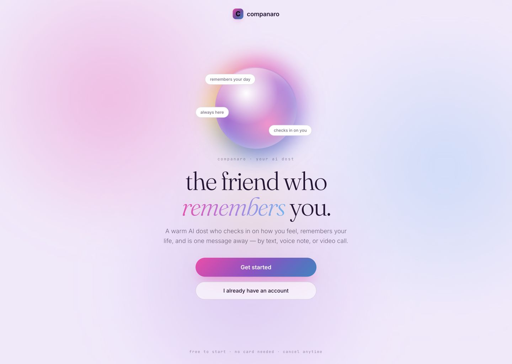

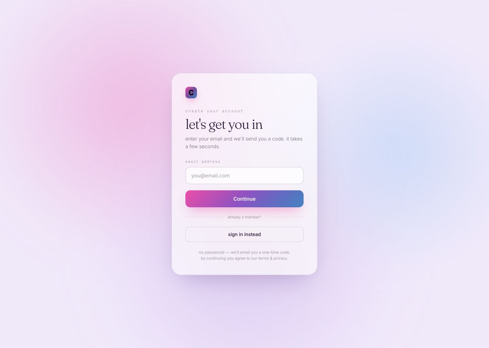

- Strong: the app entry has one dominant action, a clear returning-user path, and no-password signup reduces cognitive load.
- Strong: the account form is short, centered, and provides an explicit example format.
- Risk: marketing uses a photoreal human, while the app opens with an abstract orb and a markedly different brand mood. The transition can feel like a different product.
- Risk: account creation collects email before any visible DOB/18+ eligibility check, despite the emotional-data use case and current Gemini API age restrictions.
- Risk: no visible back action returns to the entry screen.
- Accessibility: field label, legal copy, bottom reassurance, and the “already a member?” separator are extremely small and low contrast. Terms/privacy do not look clearly interactive. Verify a programmatic label, `autocomplete="email"`, keyboard error recovery, and an announced OTP/error state.

### 9. Rendering and capture stability — critical

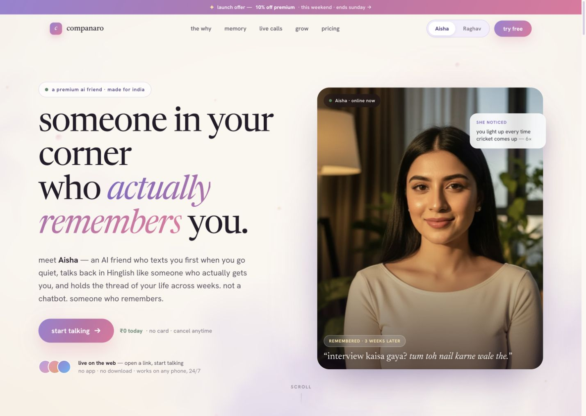

The `*-desktop-0.png` series alternates between complete pages and states where major content is visible only through narrow vertical strips. Examples include:

- `audit/reference/03-home-desktop-0.png`
- `audit/reference/05-home-desktop-0.png`
- `audit/reference/07-home-desktop-0.png`
- `audit/reference/09-home-desktop-0.png`
- `audit/reference/11-home-desktop-0.png`
- `audit/reference/13-home-desktop-0.png`
- `audit/reference/15-home-desktop-0.png`

This looks consistent with a mask/reveal animation captured mid-state or an unstable compositing layer. If users can see it, it is a P0 rendering failure; if only automation sees it, it is still a P0 visual-regression blocker. Ensure final content is the default DOM state, animations use progressive enhancement, screenshots wait for stability, and `prefers-reduced-motion` removes masks/transforms rather than freezing them mid-animation.

## Highest-impact findings

| Priority | Finding | Evidence | Recommendation |
|---|---|---|---|
| P0 | Hero/content intermittently masked into vertical strips | Repeated odd-numbered `*-desktop-0.png` captures | Remove fragile reveal masks, set visible non-animated defaults, honor reduced motion, add visual-regression waits and tests |
| P0 | Mobile sticky CTA obscures content and likely focus | `15-home-mobile-memory.png`, `16-home-mobile-pricing.png`, `17-home-mobile-faq-open.png` | Remove it on deep sections or reserve exact bottom space plus safe-area inset; verify at 200%/400% zoom |
| P1 | Fixed header hides anchor headings | Mobile memory and pricing captures | Apply `scroll-margin-top`/`scroll-padding-top` based on promo + header height; test every nav link |
| P1 | Named captures do not show named target sections | `07...there`, `08...different`, `09...faq`, `10...trust` | Fix anchor IDs/capture mapping and add assertions that the expected heading is visible |
| P1 | Free trial/plan commitment is ambiguous | Desktop/mobile pricing | Show free entitlement, trial length, renewal date, call minutes, plan selected, and when payment begins |
| P1 | Synthetic media is described as “real” | Hero and live-call captures | Replace with persistent “AI-generated/synthetic” labels while keeping the product emotional |
| P1 | Passive mood inference lacks visible consent/control | Memory/growth captures | Make it opt-in and show confidence, why it inferred the state, correction, deletion, and pause controls |
| P1 | Age gate occurs after email collection or is absent | Account-creation capture | Check 18+ eligibility and present concise data-use notice before collecting account/conversation data |
| P2 | Mobile menu lacks visual separation from page | `14-home-mobile-menu.png` | Use an opaque dialog/drawer, lock background scroll, trap/restore focus, support Escape |
| P2 | Marketing-to-app visual identity jumps | Hero vs app entry | Carry one companion cue, disclosure, typography, and promise into the entry state |

## Accessibility risks and verification gaps

### Confirmed from screenshots

- A visible blue focus treatment appears on the open mobile FAQ and menu close control.
- Large headings, generous desktop spacing, and full-row FAQ targets support readability and touch use.
- Selected companion and expanded FAQ states are not indicated by color alone.

### Likely issues requiring measurement or code testing

- Pale gray, green, lavender, and microcopy may miss text/non-text contrast.
- Moving promo/reveal effects need pause/stop behavior and reduced-motion support. See [Pause, Stop, Hide](https://www.w3.org/WAI/WCAG22/Understanding/pause-stop-hide.html).
- Sticky content can obscure keyboard focus; verify every tab stop and focus restoration. See [Focus Visible](https://www.w3.org/WAI/WCAG22/Understanding/focus-visible.html).
- Verify semantic heading order, landmark navigation, accordion button `aria-expanded`, radio/segmented-control roles, accessible icon names, image alternatives, status announcements, and language changes for Hinglish/Hindi text.
- Verify the menu traps focus without trapping the keyboard, closes with Escape, restores focus, and prevents background interaction.
- Verify audio has transcripts/captions and call controls expose state and names.
- Test 320 px width, 200% and 400% zoom, text spacing overrides, landscape mobile, safe areas, slow network, disabled animation, and high-contrast modes.

## Pre-launch recommendation

Fix the P0 rendering and mobile-obscuration defects first, then make pricing/consent/synthetic-media language trustworthy. After implementation, run keyboard and screen-reader tests plus automated and manual WCAG checks; the supplied screenshots alone cannot establish accessibility compliance.
