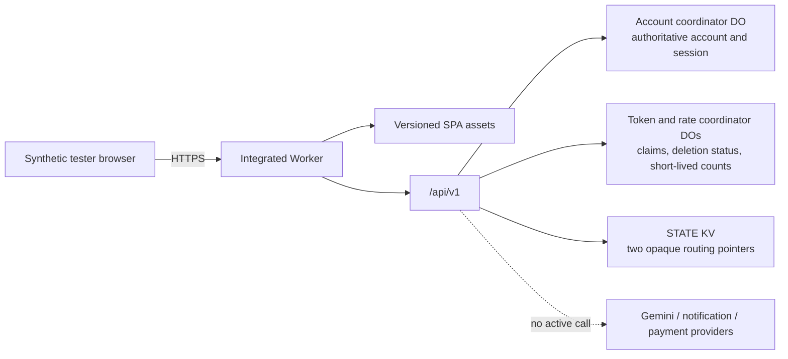

# Saathkind architecture

Last reviewed: 18 August 2026

## 1. Executive decision

Saathkind currently ships only as a synthetic, non-sensitive integrated beta. A successful deployment does not authorize real conversations, payment, AI-provider processing, or enterprise use.

The current data boundary is intentionally narrow:

- one SQLite-backed `UserStateCoordinator` Durable Object is authoritative for each synthetic account and its demo session;
- separate token-hash coordinator objects serialize bootstrap, routing recovery, and deletion status on the account's fixed horizon;
- separate hashed IP/account/global coordinator objects hold short-lived fixed-window counts and remove them by alarm;
- `STATE` KV holds only opaque session and user-session routing pointers through account expiry;
- export is an authenticated synchronous JSON response;
- a per-account Durable Object alarm irreversibly tombstones cloud state 30 days after bootstrap; users may export/delete sooner;
- ordinary chat is deterministic and disclosed; no Gemini credential is active;
- follow-ups are planner records; there is no Cron trigger or outbound notification delivery;
- D1, R2, payment, paid entitlement, and verified identity are not active.

The whole-document Durable Object coordinator is a beta concurrency and deletion mitigation. It is not the production semantic data architecture.

## 2. Current system

| Component | Current status | Release truth |
|---|---|---|
| React/Vite client | Implemented | Same-origin browser experience under `app/src`; synthetic-content warning remains part of the trust boundary. |
| Integrated Worker | Implemented | Serves versioned assets and `/api/v1`, validates bounded JSON, applies security headers/CORS, and scopes every authenticated request to the session owner. |
| `UserStateCoordinator` | Authoritative synthetic-beta account/session store | One SQLite-backed Durable Object per tenant/user stores a single bounded account document, authoritative session record, fixed 30-day expiry, revision, or deletion tombstone. |
| Token coordinator objects | Bootstrap/deletion coordination | One token-hash object stores a request fingerprint and stable opaque identity while active; completed deletion retains only status, expiry, and an opaque receipt. Its alarm follows the fixed account horizon. |
| Rate coordinator objects | Coarse abuse control | Hashed IP/account/global objects store short-lived fixed-window hit counts and delete them by alarm. They are not an entitlement or billing meter. |
| `STATE` KV | Routing only | Holds a token-hash session pointer and active user-session pointer until the account's absolute expiry. It is not account-content, claim, receipt, registry, or rate authority. |
| Chat | Deterministic beta behavior | Local crisis classification and a disclosed ordinary-chat fallback are active. No request is sent to Gemini in the deployed release. |
| Export | Synchronous | `POST /data/export` snapshots the authenticated state and returns JSON in the same response. No Queue or R2 object is created. |
| Expiry/deletion | Irreversible beta tombstone | A per-account alarm tombstones the cloud account 30 days after bootstrap; manual deletion can do so sooner and clears active KV routing. There is no global Cron, processor sweep, grace window, or restore proof. |
| Planner/follow-ups | Storage only | Records can be created and edited; nothing is delivered. No Cron trigger is attached. |
| Queue, Vectorize, D1, R2 adapters | Outside active behavior | Some bindings, types, tests, or dormant handlers remain as engineering experiments. They are not current user-facing capabilities or an activation plan. |
| Gemini, notification, payment, verified auth | Not active | No credentials/providers or commerce state are configured. Demo bootstrap is not verified identity. |

Current trust boundary:

No real private data belongs inside this boundary.

## 3. Coordinator design

The namespace key is derived from `tenantId:userId`, so one account maps to one coordinator instance. Its durable record contains `revision`, `deleted`, optional `state`, authoritative demo-session metadata, and a fixed `expiresAt`.

### 3.1 Operations

1. `POST /initialize` creates the document/session only if no state or tombstone exists and schedules an alarm for exactly 30 days after bootstrap.
2. Session validation and revocation happen inside the coordinator; KV only routes the token hash to the correct account.
3. `GET /state` returns the document and current revision, `404` when absent, or `410` after deletion.
4. `PUT /state` requires the exact current revision through `If-Match`.
5. A stale revision receives `409 state_conflict`; the caller must reload before trying a new intentional mutation.
6. `DELETE /state` removes content and writes a tombstone with a higher revision.
7. `alarm()` performs the same irreversible tombstoning when the fixed expiry arrives. It does not renew on activity.
8. A tombstoned account cannot be initialized or overwritten by a stale in-flight request.
9. A serialized document larger than 1.8 MB is rejected.

Durable Object storage and `blockConcurrencyWhile` serialize these operations. The revision check prevents a read-modify-write request from silently overwriting a newer request.

### 3.2 Deliberate limitations

- The account is one document, so unrelated changes contend on one revision.
- Conflict handling is refresh-and-retry by the user; there is no automatic semantic merge.
- The size ceiling bounds the beta and will eventually stop new content.
- There are no normalized per-record queries, partial updates, relational constraints, category-specific retention indexes, transactional outbox, supported analytics path, or evidenced restore objective.
- The only automatic lifecycle is coarse whole-account expiry 30 days after bootstrap. It is synthetic-beta hygiene, not a production retention policy.
- The tombstone blocks stale resurrection but is not processor-wide deletion evidence or a production legal-retention design.
- Fixed-window coordinator rate limiting is strongly serialized per key but remains coarse and is not a substitute for edge admission control, WAF/Turnstile, or a paid-capacity plan.

These limitations are acceptable only for a small synthetic beta.

## 4. Session and rollout boundary

The browser receives an opaque, non-renewable session token. Only its SHA-256 hash is used as the KV lookup key. The KV pointer identifies the tenant/user coordinator; the coordinator authoritatively validates/revokes the hashed session and uses its fixed expiry to schedule account tombstoning. The raw token is not stored as account content.

The coordinator rollout intentionally invalidates all pre-coordinator synthetic sessions. There is no migration or compatibility promise for earlier demo state. Release communication must tell testers to start a new synthetic demo account after cutover.

The Durable Object class creation is a forward-only storage migration. Operational recovery is therefore:

1. contain the failing route or beta;
2. preserve the current class binding and storage layout;
3. create and validate a compatible fix;
4. deploy the forward fix and run synthetic smoke tests.

Do not deploy a pre-coordinator Worker, remove the Durable Object migration, or make KV authoritative as a rollback method.

## 5. Implemented API boundary

Routes are available under `/api/v1`; `/api/*` is a compatibility alias. Responses use `{ok,data}` or `{ok:false,error}`. This contract is a demo interface, not approval for real personal data.

| Route | Current purpose | Important boundary |
|---|---|---|
| `GET /health`, `GET /pricing` | Public beta status and research pricing metadata | No billing activation or private dependency detail. |
| `POST /auth/demo` | Adult-confirmed synthetic bootstrap | Unverified identity; creates the coordinator state/session, schedules fixed 30-day expiry, and creates KV routing. |
| `GET|DELETE /session`, `POST /auth/logout` | Read/revoke the current demo session | Owner is derived from the bearer token or `HttpOnly` cookie. |
| `GET|PATCH /profile`, `/consents`, `/quiet-hours` | Account preferences and purpose choices | Whole-document revision protects concurrent writes. |
| `GET|POST /conversations` | List/create synthetic conversations | Owner-scoped account state. |
| `GET|POST /conversations/:id/messages`, `POST /chat` | Deterministic response or crisis bypass | Duplicate protection is scoped to `clientMessageId` inside the conversation. |
| Memory routes | View/approve/edit/pin/forget/pause demo memory | User controlled; no embedding generation is active. |
| Follow-up routes | Store planner records | No delivery, Cron, email, SMS, or push behavior. |
| Goal routes | Store gentle goal progress | No billing or engagement authority. |
| `GET /usage` | Display synthetic allowance | Not an atomic billing meter. |
| `POST /data/export` | Return the current account snapshot | Synchronous JSON; no Queue, R2 archive, signed URL, or server-side export record. |
| `POST /data/delete` | Tombstone account before automatic expiry | Exact `DELETE` confirmation; irreversible, no cancellation or processor-wide proof. |
| `POST /data/delete/cancel` | Compatibility response | Current immediate deletion creates nothing cancellable. |

There is no generic `Idempotency-Key` replay contract for mutations. Only chat checks `clientMessageId` to avoid a duplicate message/assistant response. Clients must not blindly replay any other mutation.

## 6. Current request flows

### 6.1 Chat

1. Authenticate through the KV session pointer and load the coordinator revision/state.
2. Validate owner, consent, input size, usage limit, conversation, and safety category.
3. If the same `clientMessageId` already exists in that conversation, return the existing result.
4. For crisis language, return deterministic India-specific escalation without model access.
5. For ordinary synthetic text, return the disclosed deterministic beta response.
6. Commit the updated whole account document with the exact prior revision.
7. On revision conflict, return `409`; do not silently overwrite or auto-replay the mutation.

### 6.2 Export

1. Authenticate and load the current account snapshot.
2. Construct a JSON object from that in-memory snapshot.
3. Return `status: ready` and the export in the same response.

The server does not enqueue, persist, archive, or later deliver the export.

### 6.3 Account deletion

1. Require the active demo session and exact confirmation text.
2. Delete the account document and atomically replace it with a content-free tombstone.
3. Reduce the token coordinator to deletion status/expiry/opaque receipt and best-effort clear the two active routing pointers from KV.
4. Expire the browser cookie; the client separately clears its local demo state.

This prevents stale-write resurrection but does not prove erasure from platform recovery history, logs, browser backups, or any future processor.

### 6.4 Automatic beta expiry

Initialization fixes account/session expiry at 30 days after bootstrap and schedules the Durable Object's own alarm. Activity does not renew it. At expiry, the alarm discards the document and authoritative session record and advances a content-free tombstone. The KV session pointer expires on the same horizon. This per-account mechanism is independent of global Cron. Users can export or delete sooner; there is no recovery window after the alarm.

## 7. Private-service architecture gate

Before real conversations, the team must write and approve a new architecture decision based on measured requirements. It must select and evidence:

- verified identity, account recovery, recent re-authentication, and admin access;
- a production data model with record-level authorization, transactions, retention enforcement, auditability, encryption/key rotation, backup and restore objectives;
- an export delivery design appropriate to sensitivity and size;
- processor contracts and deletion behavior for any model, notification, analytics, support, or payment provider actually enabled;
- asynchronous delivery semantics, reconciliation, and provider event deduplication if scheduled work or commerce is introduced;
- monitoring, on-call, incident communication, capacity and cost controls;
- a cutover and compatible forward-recovery plan tested on production-shaped synthetic data.

The inactive D1 migrations, R2 adapter, Queue consumer, or Gemini adapter do not answer this decision and must not be enabled as a shortcut.

## 8. Reliability and release criteria

The synthetic beta still needs:

- health checks that prove both `USER_STATE` and required KV bindings exist;
- tests for stale revisions, tombstone resurrection, cross-user access, size limits, session invalidation, synchronous export, and deletion;
- redacted logs that exclude tokens, email, conversations, memories, and export bodies;
- synthetic probes for root, nested route, bootstrap, chat, export, and delete;
- a recorded compatible forward-fix drill;
- a known support/incident owner.

Architecture is production-ready only when deployed behavior matches the diagrams, a reviewed real-data design replaces the beta document store, restore/deletion evidence exists, providers are contractually and technically approved, safety/security evaluations pass, and every applicable item in [go-live-checklist.md](go-live-checklist.md) is closed.
